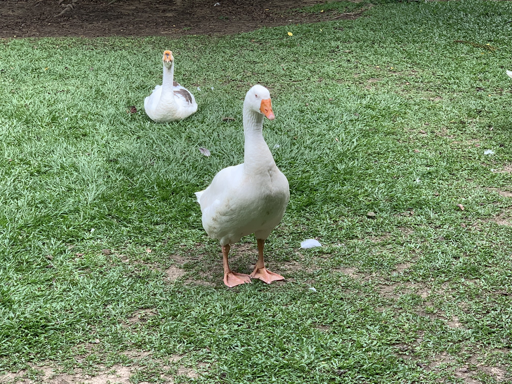
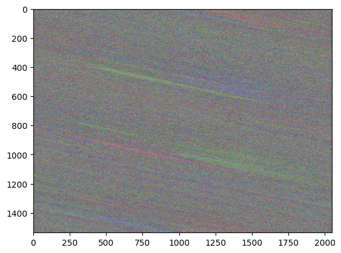
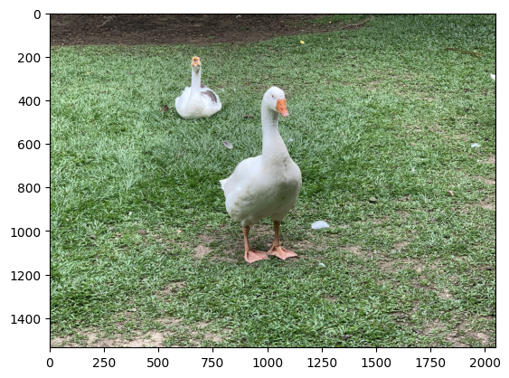

# 計算機圖學專案與實作
Implement the method in the paper with Python programming language and OpenCV library. 使用實作指定論文的方法。

## 3D-Non-equilateral-Arnold-Transform
H. Huang and Z. Cai, "Duple Color Image Encryption System Based on 3-D Nonequilateral Arnold Transform for IIoT," in IEEE Transactions on Industrial Informatics, vol. 19, no. 7, pp. 8285-8294, July 2023, doi: 10.1109/TII.2022.3217482.
keywords: {Encryption;Three-dimensional displays;Industrial Internet of Things;Color;Security;Image color analysis;Transforms;3-D Lorenz system (3D-LS);3-D nonequilateral Arnold transform (3D-NEAT);duple color image encryption algorithm;Industrial Internet of Things (IIoT)},


### Python Envioroment Installation
```
!pip install opencv-python
!pip install pandas
!pip install numpy
!pip install matplotlib
```

### Abstruct
Different from the traditional algorithm that encrypts one plain image into one ciphertext image, the proposed algorithm encrypts two color images into one color ciphertext image which can cause great confusion to the attacker who illegally breaks the ciphertext image. First, the proposed algorithm converts two color images with $N \times M$  into a 3-D bit-level matrix with $N \times M \times 48$. Next, 3-D nonequilateral Arnold transform (3D-NEAT) is applied to permutate the positions of the elements of the resulted 3-D bit-level matrix. Then, the permutated 3-D bit-level matrix is transformed into three 2-D pixel-level images and then diffused by the random diffusion sequences that 3-D Lorenz system (3D-LS) generates. Finally, the scrambling matrices generated by 3D-LS are used to scramble three diffused 2-D pixel-level images, and the output is considered as three color components of the encrypted image. The numerical experiments and security analyses show that the proposed image encryption scheme has strong resistance to several known attacks, and yields near-zero correlation and near-eight entropy for the RGB cipher image, and its performance is better than some of the recently proposed image encryption algorithms.


### Method

#### Encrypt Process
- $S$: The image to be encrypted.

1. Use OpenCV to read $S$ as RGB images. RGB images represent as `numpy ndarray` with shape `(M, N, 3)`, `M` is height, `N` is width and `3` is RGB channels.
2. Apply the following formula in multiple times:
$$
    \{S_z\}:
    \begin{bmatrix} 
    x_z \\
    y_z \\
    z_z 
    \end{bmatrix} 
    = 
    
    \begin{bmatrix}
    1 & b_z & 0 \\
    c_z & 1 + b_zc_z & 0 \\
    0 & 0 & 1
    \end{bmatrix}

    \begin{bmatrix}
    x_n \\
    y_n \\
    z_n 
    \end{bmatrix}
    \space
    mod
    \space
    \begin{matrix}
    N \\
    M \\
    K
    \end{matrix}
$$

$$
    \{S_x\}:
    \begin{bmatrix} 
    x_x \\
    y_x \\
    z_x 
    \end{bmatrix} 
    = 
    
    \begin{bmatrix}
    1 & 0 & 0 \\
    0 & 1 & b_x \\
    0 & c_x & 1 + b_xc_x
    \end{bmatrix}

    \begin{bmatrix}
    x_z \\
    y_z \\
    z_z 
    \end{bmatrix}
    \space
    mod
    \space
    \begin{matrix}
    N \\
    M \\
    K
    \end{matrix}
$$

$$
    \{S_y\}:
    \begin{bmatrix} 
    x_{n + 1} \\
    y_{n + 1} \\
    z_{n + 1} 
    \end{bmatrix} 
    = 
    
    \begin{bmatrix}
    1 + b_yc_y & 0 & c_y \\
    0 & 1 & 0 \\
    b_y & 0 & 1
    \end{bmatrix}

    \begin{bmatrix}
    x_x \\
    y_x \\
    z_x 
    \end{bmatrix}
    \space
    mod
    \space
    \begin{matrix}
    N \\
    M \\
    K
    \end{matrix}
$$

$$
where \\
c_z = r_z * \frac{M}{gcd(N, M)},c_x = r_x * \frac{K}{gcd(M, K)}, c_y = \frac{N}{gcd(K, N)} \\ \space \\
gcd(.) = greatest \ common \ divisor, \\ b_x, b_y, b_z, r_x, r_y, r_z \in Z^+
$$

3. Output the encrypted image.

### Result
There are gooses in National Chung Hsing University.

Source image: 


Encrypted image:



Decrypted image:
